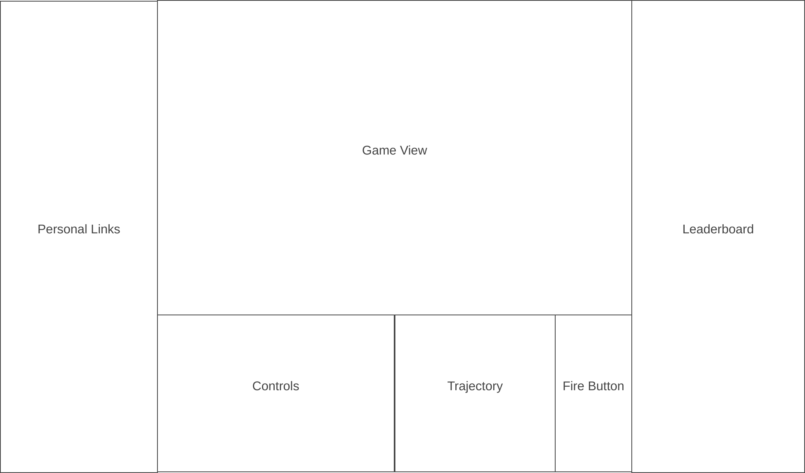

My project will be based of Pocket Tanks with my own personal spin on it. Battlefield: Tanks, will have two opposing tanks that shoots projectiles, affected by terrain and gravity, in order to destroy your enemies. There will be a wide range of tanks to choose
from, each have their own edge over others i.e. more health or damage. Battlefield: Tanks will be a turn based game where each turn there is a countdown representing the amount of time you have to move and be precise with your angle as well as your power. As long as the projectile is on screen any terrain that has contact with the projectile will be affected. My project will include an AI to play against thats scaleable in difficulty. The game will be over once a tank's health reaches 0. If I have more time I would want to implement a scoreboard to show how many wins a certain user has.

In Battlefield: Tanks, users will be able to:
    - Core Features/ Functionlities Shoot a projectile, affected by terrain and gravity. Projectiles affect terrain and deal damage to tanks. You can adjust angle and power. Game is over if one tank runs out of health. 
    - Feature: Have a scaleable difficulity AI to play against.
    - Feature: Have a range of tanks to choose from.
    - Feature: Have a scoreboard to show user wins.
    - Feature: Have a countdown at the start of every turn and if its not your turn you can't move.

In addition, this project will include:
    - Instructions, README 
    - Potential Improvements 
    - About Me Links

Wireframe :
    

Technologies, Libraries, APIs: 
    I plan on using https://wellcaffeinated.net/PhysicsJS/ to apply gravity to my projectiles. I plan on using https://itch.io/game-assets to apply sprites and texture to my game. I will also be using https://www.w3schools.com/jsref/api_canvas.asp, canvas API to generate curves for my projectiles.

Implementation Timeline
    Friday Afternoon & Weekend: Implement the shooting functionality and correct gravity implemention. Register the hits on enemy tanks and decrease health.
    Monday: Have projectiles affect the terrain. Create a functional menu. Finish personal links and controls /fire button.
    Tuesday: Make a scaleable AI to play against. Texture and sprites. 
    Wednesday: Have a leaderboard. Sound files. Have a mute button. Test runs.
    Thursday: Run my project a few more times to make sure everything works.