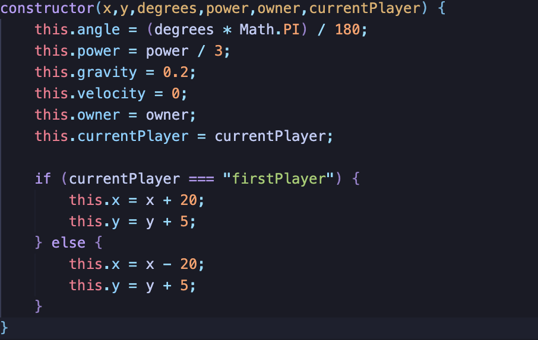

 

# Description
    My project will be based on Pocket Tanks with my own personal spin on it. Battlefield: Tanks, will have two opposing tanks that shoot projectiles and gravity, in order to destroy your enemies. Battlefield: Tanks will be a turn-based game where each turn there is a precise angle and power indicator. As long as the projectile is on screen the opposing tank that comes into contact with the projectile will be depleted of health. The game will be over once a tank's health reaches 0. 

# Controls
    Battlefield: Tanks is played with keyboard. Keys A and D are for movement left and right respectively. Keys W and S are for adjusting the angle respectively. Keys Q and E are for adjusting the power respectively. The fire button would be the spacebar.

 

# Technical Details 
    Battlefield:Tanks was coded using vanilla Javascript. The game was drawn on canvas and I also used some HTML and CSS. I also implemented some visual interperation of an angle to display your direction that you'll be firing towards as well as a power guage to visual see your power in numbers.

# Feature Implementation
    I have event listeners on several buttons to determine if any given tank is allowed to act during a certain action.
 

    My project includes implemention of gravity manpulation on my projectiles and repositioned them to fire from the tip of the tank sprite regardless of the current player.
 

    A decaying health bar for when a target get damaged. 

    Another feature in my project would be collosion detection and out of frame functionality.

# Features In Development: 
    Making a leaderboard. AI scalability in difficulty. Timer in between turns. Terrain generation and manpulation. Wide range of tank selection.